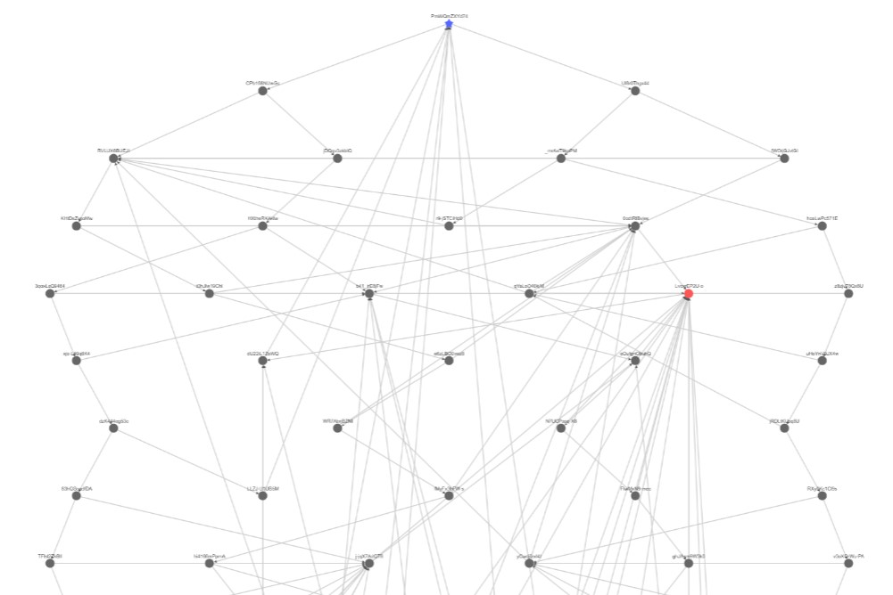

# Visualization of CGP Grey's 1-in-a-million rock paper series  

#### Why?
I thought it would be cool. I also wanted to see how many videos there were

#### How?
Built using Sveltekit and Cytoscape. Video data was scraped directly from YouTube's website since the API does not support endscreens.

#### Where?
[Link to visualization](https://md-y.github.io/one-in-a-million-visualized/)

[Link to original video](https://www.youtube.com/watch?v=PmWQmZXYd74)

#### What?
Here's what the graph looks like:

